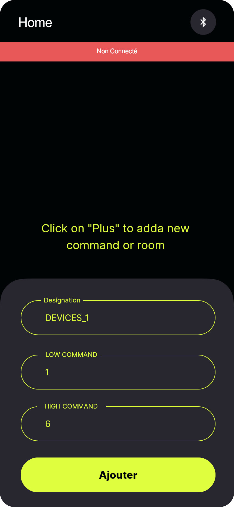
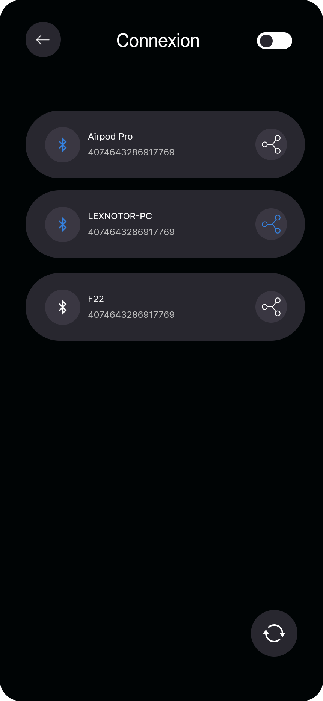
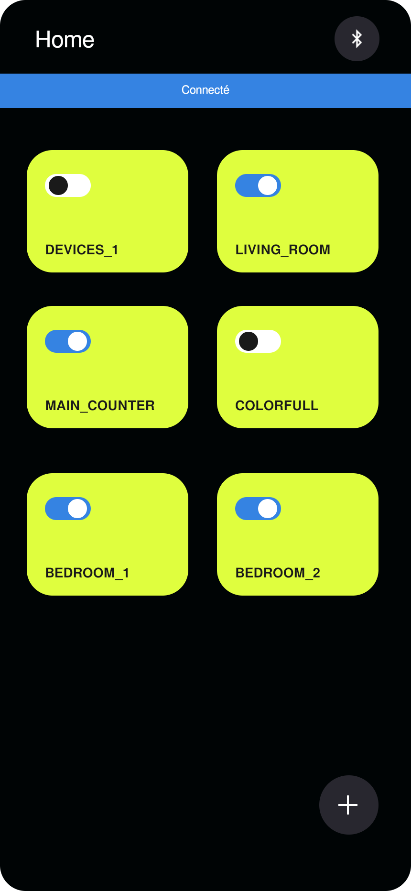
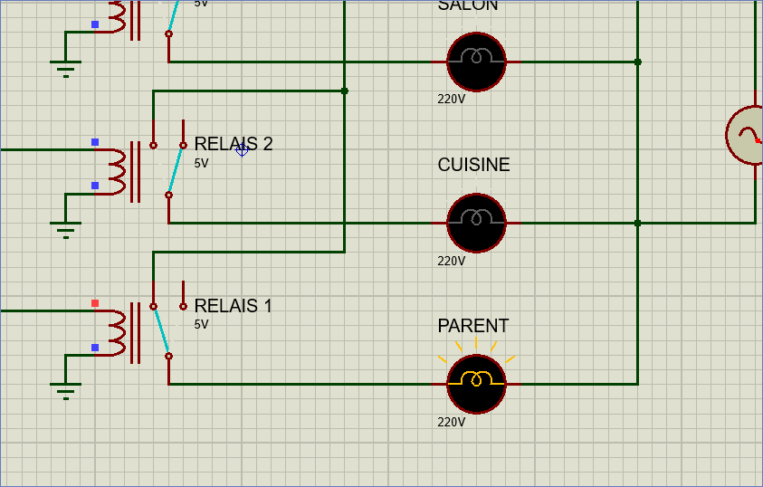
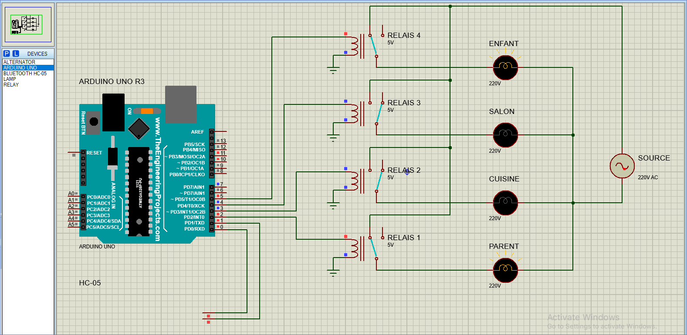

<!-- markdownlint-disable MD030 -->

# home-domotique-app

A flutter app for managing **on** and **off** state of devices in a home, using Bluetooth

## Utils

To test this project you can use Proteus Lab, find the project file under `./proteus_arduino_screenshoot/proteus_sketch.pdsprj`

Also a prepared Arduino code is reading for testing purpose, find it `./proteus_arduino_screenshoot/code_arduino.ino`

## Build android app

-   This is a flutter app, be sure you flutter is installing on you PC. Then clone the project:

```bash
git clone https://github.com/lexnotor/home-domotique-app.git
```

-   After that, install app dependancies by running

```bash
flutter pub get
```

-   Finally build the Apk

```bash
flutter build apk
```

-   Now you should find the apk under `./build/app/outputs/flutter-apk/app-release.apk`

## APP Screenshoot







## Proteus Screenshoot




## Author

-   [Alexandre CHAMBU](https://linkedin.com/in/lexnotor/) @lexnotor
